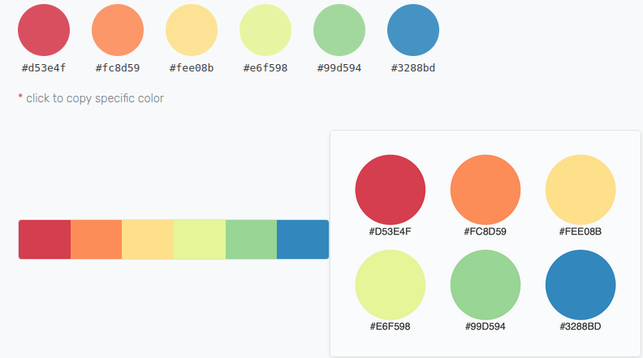
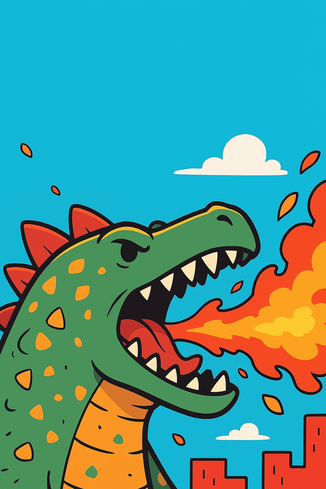

# Palette de couleur 

**[Image Into Palette Link](https://coolors.co/image-picker)**

## Pastel one

```markdown
    #d53e4f
    #fc8d59
    #fee08b
    #e6f598
    #99d594
    #3288bd
```


# Dragon qui crache du feu

Image associé:


Vert foncé

    Utilisé pour le corps du dinosaure.

    Code approximatif : #2D7A3F

Orange vif

    Utilisé pour les écailles, les flammes, et l’intérieur de la bouche.

    Code approximatif : #F76C1E

Rouge vif

    Utilisé pour les pics dorsaux et les flammes.

    Code approximatif : #E6391F

Jaune doré

    Présent dans la flamme et sur le ventre du dinosaure.

    Code approximatif : #F4B942

Bleu ciel

    Couleur du fond (ciel).

    Code approximatif : #00BCEB

Blanc pur

    Utilisé pour les nuages et les dents.

    Code approximatif : #FFFFFF

Noir profond

    Utilisé pour les contours et l’intérieur de la bouche.

    Code approximatif : #000000

